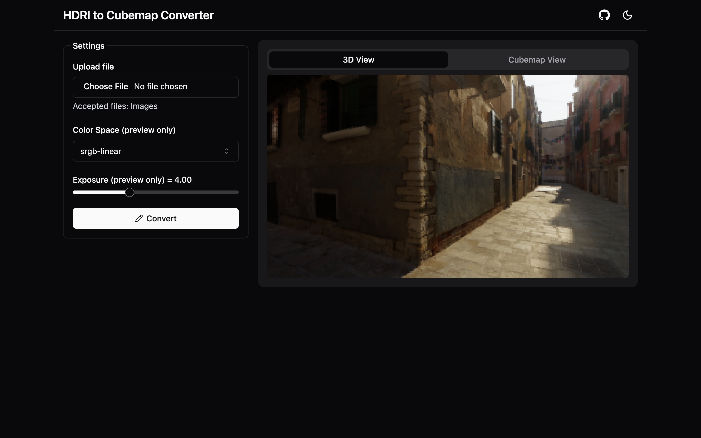
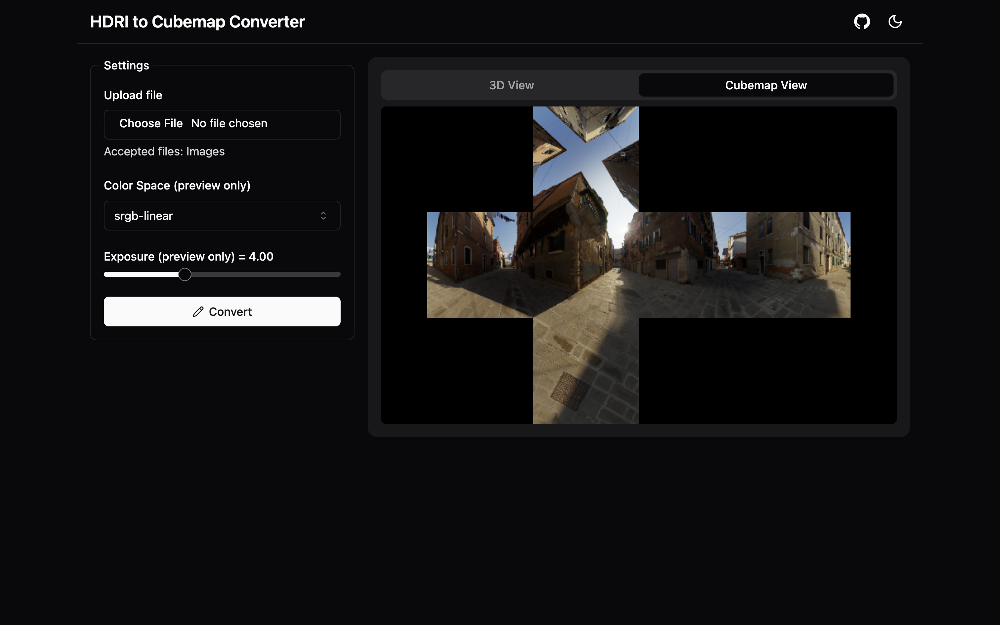

# HDRI to Cubemap Converter - Web GUI

This project provides a web-based GUI built with React for converting HDR images (HDRIs) into cubemaps. It’s a fast, intuitive, and accessible tool for 3D artists, game developers, and VR/AR creators who need to generate cubemaps for their environments.

## Features

- **User-Friendly Web Interface**: Convert HDRIs to cubemaps directly in your browser.
- **HDRI to Cubemap Conversion**: Processes high dynamic range images and outputs cubemaps in various formats.
- **Cubemap Faces Preview**: View each face of the generated cubemap in real-time.
- **Custom Resolution**: Select your preferred output resolution.
- **Drag-and-Drop Functionality**: Easily upload HDRI files by dragging them onto the web interface.
- **Cross-Browser Compatibility**: Works on Chrome, Firefox, Edge, and Safari.

## Technologies Used

- **React**: Frontend library for building the user interface.
- **Three.js**: 3D graphics library used for handling the cubemap generation and preview.
- **Tailwind CSS**: For styling.

## Installation

### Prerequisites

Ensure that you have the following installed:

- **Node.js**: Download from [nodejs.org](https://nodejs.org/) if you don't have it installed.
- **npm or Yarn**: Node package manager. Comes with Node.js, but Yarn is also supported.

### Setup

1. Clone the repository:

   ```bash
   git clone https://github.com/hichemfantar/hdri-to-cubemap-converter.git
   cd hdri-to-cubemap-converter
   ```

2. Install the dependencies:

   ```bash
   npm install
   # or
   yarn install
   ```

3. Start the development server:

   ```bash
   npm run dev
   # or
   yarn dev
   ```

4. Open your browser and go to `http://localhost:5173` to see the app.

## Usage

1. Open the app in your browser.
2. Drag and drop an HDRI file into the provided area or use the file picker to upload.
3. Choose the desired resolution and output format (PNG, JPEG, EXR).
4. Preview the cubemap faces in the interface.
5. Click the "Download" button to save the cubemap to your device.

## Available Scripts

- `npm run dev`: Runs the app in development mode.
- `npm run build`: Builds the app for production.
- `npm run preview`: Preview the production build.
- `npm run lint`: Lints the codebase for style and quality issues.

## Deployment

To deploy the app for production:

1. Run the build command:

   ```bash
   npm run build
   ```

2. The build artifacts will be stored in the `dist/` folder.
3. You can deploy this `dist/` folder to any static hosting service like Netlify, Vercel, or GitHub Pages.

## Contributing

Contributions are highly encouraged! Here's how you can get involved:

1. Fork the repository.
2. Create a new branch (`git checkout -b feature-branch`).
3. Make your changes.
4. Commit your changes (`git commit -m 'Add some feature'`).
5. Push to the branch (`git push origin feature-branch`).
6. Open a pull request.

## To-Do

- [ ] Add batch processing of multiple HDRIs.
- [ ] Enable GPU acceleration for faster conversion.
- [ ] Improve error handling and user feedback.

## License

This project is licensed under the MIT License - see the [LICENSE](LICENSE.txt) file for details.

---

For any issues or feature requests, feel free to open an issue in the [GitHub Issues](https://github.com/hichemfantar/hdri-to-cubemap-converter/issues) section.

## Screenshots


*Main interface showing file upload and conversion options.*


*Cubemap face preview after HDRI conversion.*

## Built with Vite

Built with [React + TypeScript + Vite template](/vite.md).

## Credits

Built by [Hichem Fantar](https://github.com/hichemfantar) using React and Three.js.

Thanks [matheowis](https://github.com/matheowis/HDRI-to-CubeMap) for the inspiration.
